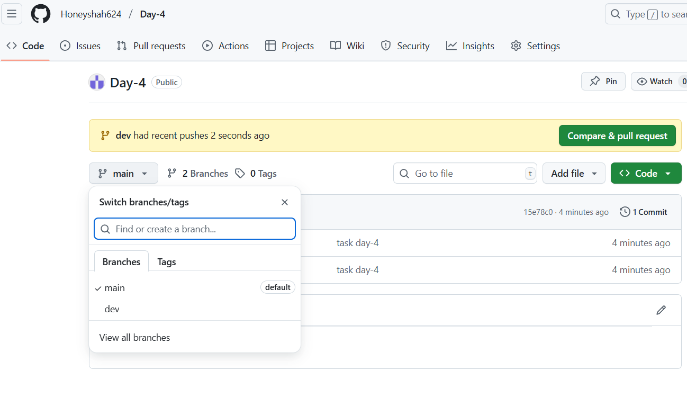
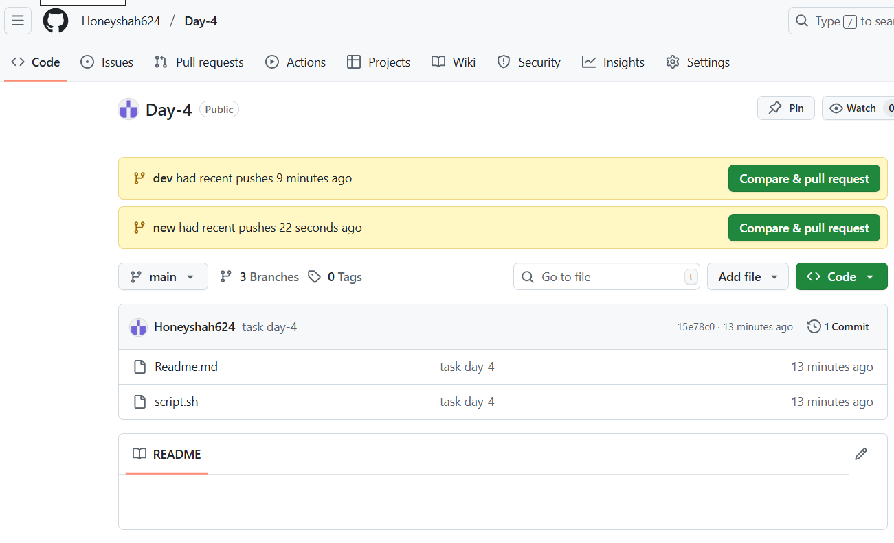
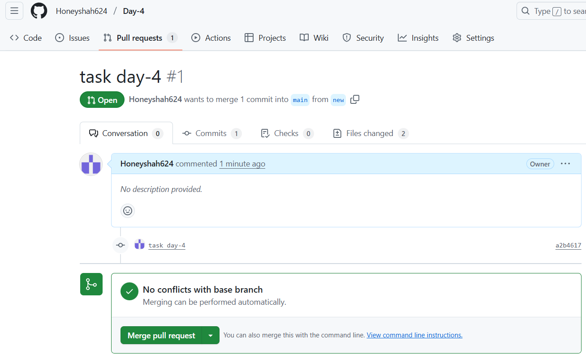

# Build a Version-Controlled DevOps Project with Git 

##  Prerequisites

+ Tools Required:
  + Git (installed on your system)

  + GitHub account
---
# Step-by-Step Solution:
###  STEP 1: Create a New Local Git Repository
Open your terminal (or Git Bash) and run:

```bash
mkdir devops-task-4
cd devops-task-4
git init
```
### STEP 2: Add a Sample Project (Optional or Placeholder)
Create a dummy Script :

```bash
 #!/bin/bash

echo "What is your full name?"
read name

echo "Hello, $name!"

echo "The current date and time is:"
date

echo "Here are the files in your current directory:"
ls

```

### STEP 3: Create a README.md File
```bash
touch README.md
```
#### Example content:
```markdown
 

## Features
- Multiple branches
- Pull requests
```
### STEP 4: Make Your First Commit
```bash
git add .
git commit -m "Initial commit: Setup project structure, .gitignore and README"
```
### STEP 5: Create a GitHub Repository
Go to GitHub

Click "New Repository"

Name it devops-task-4

DO NOT initialize with README (you already have it locally)

Copy the remote URL and link to your local repo:

```bash
git remote add origin https://github.com/your-username/devops-task-4.git
git push -u origin main
```
### STEP 6: Create and Work with Branches
Create a dev branch:
```bash
git checkout -b dev
# simulate work on the feature
echo "// login feature code" > scripts/login.js
git add scripts/login.js
git commit -m "Add login module feature"
git push origin new
```

<br> <br>


### STEP 7: Create Pull Requests on GitHub
Go to GitHub > Pull Requests

Create PR from feature/login-module → dev

Review and Merge

Then create PR from dev → main and merge




# Task Log

## Branches Created:
- main
- dev
- new

## Pull Requests:
- Merged new to main

---
